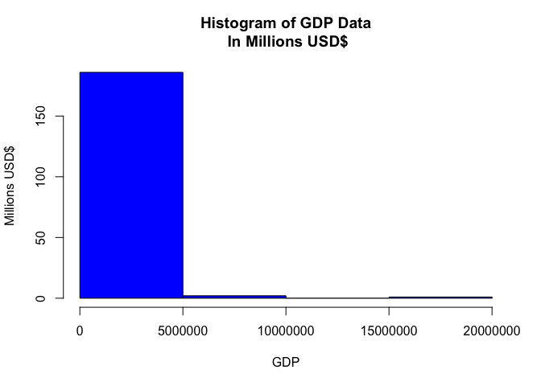

# Gross Domestic Product Analysis
Ivelin Angelov, Laura Bishop, Ethan Graham, Scott Gozdzialski  
10-03-2017  


#Introduction
The global economy is accelerating at a rapid pace.
The World Bank, which is the world's largest development institution, looks at influencing factors like climate change, conflict, food security, education, agriculture, finance, and trade.
Questions are being asked about Gross Domestic Product (GDP) and Income categories for 189 countries in which there is sufficient data to analyze. 

The data source for this analysis is from the World Bank's Education Statistics (http://datatopics.worldbank.org/education/) web site for basic information on a country, including income grouping, date of last census data, systems of trade, government accounting approach, and many others basic data points except GDP. The GDP information, also from the World Bank, is not a part of the Education Statistics information collection and dissemination. 

It is important to note that the World Bank's Education Statistics (EDSstat) does differentiate between countries that participate in the Organization of Economic Cooperation and Development (OECD). The OECD was founded in 1960 and contains 35 member countries today, including the United States, United Kingdom, and Germany.
The goal of this organization is to help developing countries create and sustain economic prosperity.
In this analysis, the  "Income Group" used in the ranking of GDP for a country does contain an indicator of whether a high income country is part of the OECD.<br/>

This analysis takes a closer look at the relationship between GDP and Income Groups.

###1. With the merged data frame how many IDs matched?

Merging the Data from the EDStats with the GDP data, it is expected that some of the row will not perfectly match up.
Looking at the data from both sets and merging them together we end up with some data points that do not have information in the GDP, so we did not include those values in the data.


```r
cat('There are', nrow(Data), 'rows of clean merged data for further analysis.')
```

```
## There are 189 rows of clean merged data for further analysis.
```


###2. With the the data frame in decending order by GDP(United States last) what is the 13th value?
So you maybe wondering where different countries lie within this list of countries or what country lies in which position.
Here is an example of which county lie at the thirteenth position if we order the data in decending order.
This lists row in unordered data frame, three letter country code, countyr name, GDP in millions of US dollars, and finaly which  Organization of Economic Cooperation and Developement group it belongs.


```r
# reorder by GDP
Data = Data[order(Data$GDP),]
# print 13-th
cat('The 13th country in the sorted dataset is:', as.character(Data$CountryName[13]))
```

```
## The 13th country in the sorted dataset is: St. Kitts and Nevis
```

###3. What are the average GDP rankings for the "High Income: OECD" and "High Income:nonOECD" groups?

We have talked about different groups as classified by the Organization of Economic Cooperation and Development (OECD).
There are five different groups.
They are the high income and member of the OECD, the high income and non-member OECD, the upper middle income, the middle income, and the low income groups.
Now for us to look if there is a difference between being a member of the OECD makes a difference the only way we can do that is by comparing the the average incomes of the high income OECD to the high income nonOECD, since they are the only groups with a counter part.<br/> 


```r
Data$GDP.rankings = rank(Data$GDP)
OECD_rankings = Data$GDP.rankings[Data$Income.Group == "High income: OECD"]
cat('The "High income: OECD" group has an average GDP of', mean(OECD_rankings),'millions in US dollars.')
```

```
## The "High income: OECD" group has an average GDP of 157.0333 millions in US dollars.
```

```r
nonOECD_rankings = Data$GDP.rankings[Data$Income.Group == "High income: nonOECD"]
cat('The high income nonOECD group had an average GDP of', mean(nonOECD_rankings), 'millions in US dollars.') 
```

```
## The high income nonOECD group had an average GDP of 98.34783 millions in US dollars.
```
You can see the OECD group has a higher average GDP.

###4. 1	Plot the GDP for all of the countries. Use ggplot2 to color your plot by Income Group.

It is hard to visualize all the data of the countries we have in our data frame in our minds.
To help with this we will plot that different groups in a chart below.

```r
# install ggplot2 and scales in case its not
if("ggplot2" %in% rownames(installed.packages()) == FALSE){
  install.packages("ggplot2", repos = structure(c(CRAN = "http://cran.r-project.org")))
}
if("scales" %in% rownames(installed.packages()) == FALSE){
  install.packages("scales", repos = structure(c(CRAN = "http://cran.r-project.org")))
}
if("Hmisc" %in% rownames(installed.packages()) == FALSE){
  install.packages("Hmisc", repos = structure(c(CRAN = "http://cran.r-project.org")))
}
if("lattice" %in% rownames(installed.packages()) == FALSE){
  install.packages("lattice", repos = structure(c(CRAN = "http://cran.r-project.org")))
}  
  
# load the packages
require(ggplot2)
```

```
## Loading required package: ggplot2
```

```r
require(scales)  # allows for setting up the ggplot
```

```
## Loading required package: scales
```

```r
require (Hmisc) # for conclusion
```

```
## Loading required package: Hmisc
```

```
## Loading required package: lattice
```

```
## Loading required package: survival
```

```
## Loading required package: Formula
```

```
## 
## Attaching package: 'Hmisc'
```

```
## The following objects are masked from 'package:base':
## 
##     format.pval, round.POSIXt, trunc.POSIXt, units
```

```r
require (lattice) # for histograms in conclusion

options(scipen=10000)  # gets rid of the exponential numbers on the Y axis

ggplot (Data, aes(x=Data$Income.Group, y=Data$GDP)) + # sets up GGPLOT2 scatter plot
  scale_y_continuous(name="GDP -- In USD$ Millions", labels= scales::comma, expand = c(0,0), limits=c(0, 20000000), breaks=seq(0,18000000, 2000000))  + #sets up Y axis with labels and range
  scale_x_discrete ("Income Group", labels = c("Low income" = "LI", "High income: nonOECD" = "nHI", "High income: OECD" = "oHI", "Lower middle income" = "LMI", "Upper middle income" = "UMI")) + # sets up x axis for abbreviates of categorical variable to prevent overlap and promote readability
  theme (aspect.ratio = 2/1) + #sets up aspect ratio so consistent with each output
  geom_point(aes(color = Data$Income.Group)) +  #sets up colored points
  scale_color_discrete (name="Income Group") #changes legend title
```

<!-- -->

##5. Cut the GDP rankings into 5 seperate quantile groups. Making a table versus income group.
##   How many countries are "lower middle income" but within the 38 nations with the highest GDP?
Looking at the chart above we can see that the groups are not built on GDP alone.
The selection into the igh income and member of the OECD, the high income and non-member OECD, the upper middle income, the middle income, and the low income groups come from many variables.
With this knowledge we can see that some members of the lower income groups may have the higher GDP then members of the high income group.
So, how many of the countries in the top 38 GDPs are actual in the lower middle income?  


```r
if("DT" %in% rownames(installed.packages()) == FALSE){
  install.packages("DT", repos = structure(c(CRAN = "http://cran.r-project.org")))
}
require('DT')
```

```
## Loading required package: DT
```

```r
# Split the rankings to 5 quantile groups
OrderData <- Data[order(Data$GDP.rankings), c(1:4)]
colNames <- c("Country Name", "Country Code", "GDP in Millions USD$", "Income Group")
datatable(
  OrderData[c('CountryName', 'CountryCode', 'GDP', 'Income.Group')],
  options = list(pageLength = 15),
  caption = "Ranking in Income Groups"
)
```

<!--html_preserve--><div id="htmlwidget-7a1434fcf4c9a8e2a0e2" style="width:100%;height:auto;" class="datatables html-widget"></div>
<script type="application/json" data-for="htmlwidget-7a1434fcf4c9a8e2a0e2">{"x":{"filter":"none","caption":"<caption>Ranking in Income Groups\u003c/caption>","data":[["173","92","113","137","155","59","169","46","39","184","180","69","93","183","66","65","151","161","8","100","168","22","99","28","40","30","111","102","12","1","71","52","160","152","164","57","120","26","122","117","156","23","64","108","95","90","125","166","146","109","14","75","19","116","97","114","189","7","110","118","115","15","121","127","4","163","124","82","37","91","149","119","29","85","138","62","27","187","20","67","60","73","130","175","2","188","54","43","170","153","35","36","142","24","174","105","18","86","167","185","134","154","89","63","55","103","98","106","41","158","171","177","70","17","179","104","148","48","74","101","21","11","42","132","162","50","157","107","140","3","16","76","182","96","131","143","176","144","44","88","135","49","81","79","141","133","56","68","136","83","126","51","72","33","150","123","47","5","165","38","181","186","10","6","13","139","129","80","159","32","147","128","172","77","94","112","53","9","31","78","84","145","25","61","58","45","87","34","178"],["Tuvalu","Kiribati","Marshall Islands","Palau","S�o Tom� and Principe","Micronesia, Fed. Sts.","Tonga","Dominica","Comoros","Samoa","St. Vincent and the Grenadines","Grenada","St. Kitts and Nevis","Vanuatu","Guinea-Bissau","Gambia, The","Solomon Islands","Seychelles","Antigua and Barbuda","St. Lucia","Timor-Leste","Belize","Liberia","Bhutan","Cape Verde","Central African Republic","Maldives","Lesotho","Burundi","Aruba","Guyana","Eritrea","Swaziland","Sierra Leone","Togo","Fiji","Mauritania","Barbados","Malawi","Montenegro","Suriname","Bermuda","Guinea","Monaco","Kosovo","Kyrgyz Republic","Niger","Tajikistan","Rwanda","Moldova","Benin","Haiti","Bahamas, The","Malta","Lao PDR","Macedonia, FYR","Zimbabwe","Armenia","Madagascar","Mongolia","Mali","Burkina Faso","Mauritius","Nicaragua","Albania","Chad","Namibia","Iceland","Congo, Rep.","Cambodia","Senegal","Mozambique","Botswana","Jamaica","Papua New Guinea","Georgia","Brunei Darussalam","Congo, Dem. Rep.","Bosnia and Herzegovina","Equatorial Guinea","Gabon","Honduras","Nepal","Uganda","Afghanistan","Zambia","Estonia","Cyprus","Trinidad and Tobago","El Salvador","C�te d'Ivoire","Cameroon","Paraguay","Bolivia","Tanzania","Latvia","Bahrain","Jordan","Turkmenistan","Yemen, Rep.","Panama","Serbia","Kenya","Ghana","Ethiopia","Lithuania","Lebanon","Macao SAR, China","Costa Rica","Slovenia","Tunisia","Uruguay","Guatemala","Bulgaria","Uzbekistan","Luxembourg","Sudan","Dominican Republic","Croatia","Sri Lanka","Belarus","Azerbaijan","Cuba","Oman","Syrian Arab Republic","Ecuador","Slovak Republic","Morocco","Puerto Rico","Angola","Bangladesh","Hungary","Vietnam","Kuwait","New Zealand","Qatar","Ukraine","Romania","Czech Republic","Kazakhstan","Peru","Algeria","Iraq","Ireland","Portugal","Pakistan","Finland","Greece","Philippines","Israel","Nigeria","Egypt, Arab Rep.","Hong Kong SAR, China","Chile","Singapore","Malaysia","Denmark","United Arab Emirates","Thailand","Colombia","Venezuela, RB","South Africa","Austria","Argentina","Belgium","Poland","Norway","Iran, Islamic Rep.","Sweden","Switzerland","Saudi Arabia","Netherlands","Turkey","Indonesia","Korea, Rep.","Mexico","Spain","Australia","Canada","India","Italy","Russian Federation","Brazil","United Kingdom","France","Germany","Japan","China","United States"],["TUV","KIR","MHL","PLW","STP","FSM","TON","DMA","COM","WSM","VCT","GRD","KNA","VUT","GNB","GMB","SLB","SYC","ATG","LCA","TMP","BLZ","LBR","BTN","CPV","CAF","MDV","LSO","BDI","ABW","GUY","ERI","SWZ","SLE","TGO","FJI","MRT","BRB","MWI","MNE","SUR","BMU","GIN","MCO","KSV","KGZ","NER","TJK","RWA","MDA","BEN","HTI","BHS","MLT","LAO","MKD","ZWE","ARM","MDG","MNG","MLI","BFA","MUS","NIC","ALB","TCD","NAM","ISL","COG","KHM","SEN","MOZ","BWA","JAM","PNG","GEO","BRN","ZAR","BIH","GNQ","GAB","HND","NPL","UGA","AFG","ZMB","EST","CYP","TTO","SLV","CIV","CMR","PRY","BOL","TZA","LVA","BHR","JOR","TKM","YEM","PAN","SRB","KEN","GHA","ETH","LTU","LBN","MAC","CRI","SVN","TUN","URY","GTM","BGR","UZB","LUX","SDN","DOM","HRV","LKA","BLR","AZE","CUB","OMN","SYR","ECU","SVK","MAR","PRI","AGO","BGD","HUN","VNM","KWT","NZL","QAT","UKR","ROM","CZE","KAZ","PER","DZA","IRQ","IRL","PRT","PAK","FIN","GRC","PHL","ISR","NGA","EGY","HKG","CHL","SGP","MYS","DNK","ARE","THA","COL","VEN","ZAF","AUT","ARG","BEL","POL","NOR","IRN","SWE","CHE","SAU","NLD","TUR","IDN","KOR","MEX","ESP","AUS","CAN","IND","ITA","RUS","BRA","GBR","FRA","DEU","JPN","CHN","USA"],[40,175,182,228,263,326,472,480,596,684,713,767,767,787,822,917,1008,1129,1134,1239,1293,1493,1734,1780,1827,2184,2222,2448,2472,2584,2851,3092,3744,3796,3814,3908,4199,4225,4264,4373,5012,5474,5632,6075,6445,6475,6773,6972,7103,7253,7557,7843,8149,8722,9418,9613,9802,9951,9975,10271,10308,10441,10486,10507,12648,12887,13072,13579,13678,14038,14046,14244,14504,14755,15654,15747,16954,17204,17466,17697,18377,18434,18963,19881,20497,20678,22390,22767,23320,23864,24680,25322,25502,27035,28242,28373,29044,31015,35164,35646,36253,37489,40697,40711,41605,42344,42945,43582,45104,45279,45662,49920,50234,50972,51113,55178,58769,59047,59228,59423,63267,66605,68234,69972,73672,84040,91149,95982,101496,114147,116355,124600,155820,160913,167347,171476,176309,192711,196446,203521,203790,205789,210280,210771,212274,225143,247546,249099,250182,258217,262597,262832,263259,269869,274701,305033,314887,348595,365966,369606,381286,384313,394708,475502,483262,489795,499667,514060,523806,631173,711050,770555,789257,878043,1129598,1178126,1322965,1532408,1821424,1841710,2014670,2014775,2252664,2471784,2612878,3428131,5959718,8227103,16244600],["Lower middle income","Lower middle income","Lower middle income","Upper middle income","Lower middle income","Lower middle income","Lower middle income","Upper middle income","Low income","Lower middle income","Upper middle income","Upper middle income","Upper middle income","Lower middle income","Low income","Low income","Low income","Upper middle income","Upper middle income","Upper middle income","Lower middle income","Lower middle income","Low income","Lower middle income","Lower middle income","Low income","Lower middle income","Lower middle income","Low income","High income: nonOECD","Lower middle income","Low income","Lower middle income","Low income","Low income","Upper middle income","Low income","High income: nonOECD","Low income","Upper middle income","Upper middle income","High income: nonOECD","Low income","High income: nonOECD","Lower middle income","Low income","Low income","Low income","Low income","Lower middle income","Low income","Low income","High income: nonOECD","High income: nonOECD","Low income","Upper middle income","Low income","Lower middle income","Low income","Lower middle income","Low income","Low income","Upper middle income","Lower middle income","Upper middle income","Low income","Upper middle income","High income: OECD","Lower middle income","Low income","Lower middle income","Low income","Upper middle income","Upper middle income","Lower middle income","Lower middle income","High income: nonOECD","Low income","Upper middle income","High income: nonOECD","Upper middle income","Lower middle income","Low income","Low income","Low income","Low income","High income: nonOECD","High income: nonOECD","High income: nonOECD","Lower middle income","Lower middle income","Lower middle income","Lower middle income","Lower middle income","Low income","High income: nonOECD","High income: nonOECD","Lower middle income","Lower middle income","Lower middle income","Upper middle income","Upper middle income","Low income","Low income","Low income","Upper middle income","Upper middle income","High income: nonOECD","Upper middle income","High income: OECD","Lower middle income","Upper middle income","Lower middle income","Upper middle income","Lower middle income","High income: OECD","Lower middle income","Upper middle income","High income: nonOECD","Lower middle income","Upper middle income","Upper middle income","Upper middle income","High income: nonOECD","Lower middle income","Lower middle income","High income: OECD","Lower middle income","High income: nonOECD","Lower middle income","Low income","High income: OECD","Lower middle income","High income: nonOECD","High income: OECD","High income: nonOECD","Lower middle income","Upper middle income","High income: OECD","Upper middle income","Upper middle income","Upper middle income","Lower middle income","High income: OECD","High income: OECD","Lower middle income","High income: OECD","High income: OECD","Lower middle income","High income: OECD","Lower middle income","Lower middle income","High income: nonOECD","Upper middle income","High income: nonOECD","Upper middle income","High income: OECD","High income: nonOECD","Lower middle income","Upper middle income","Upper middle income","Upper middle income","High income: OECD","Upper middle income","High income: OECD","High income: OECD","High income: OECD","Upper middle income","High income: OECD","High income: OECD","High income: nonOECD","High income: OECD","Upper middle income","Lower middle income","High income: OECD","Upper middle income","High income: OECD","High income: OECD","High income: OECD","Lower middle income","High income: OECD","Upper middle income","Upper middle income","High income: OECD","High income: OECD","High income: OECD","High income: OECD","Lower middle income","High income: OECD"]],"container":"<table class=\"display\">\n  <thead>\n    <tr>\n      <th> \u003c/th>\n      <th>CountryName\u003c/th>\n      <th>CountryCode\u003c/th>\n      <th>GDP\u003c/th>\n      <th>Income.Group\u003c/th>\n    \u003c/tr>\n  \u003c/thead>\n\u003c/table>","options":{"pageLength":15,"columnDefs":[{"className":"dt-right","targets":3},{"orderable":false,"targets":0}],"order":[],"autoWidth":false,"orderClasses":false,"lengthMenu":[10,15,25,50,100]}},"evals":[],"jsHooks":[]}</script><!--/html_preserve-->

```r
top38 <- tail(Data, n = 38)
# an answer to the question: How many countries are "lower middle income" but within the 38 nations with the highest GDP
cat('There are', NROW(top38[top38$Income.Group == 'Lower middle income', ]), 'countries "lower middle income" but within the 38 nations with the highest GDP')
```

```
## There are 5 countries "lower middle income" but within the 38 nations with the highest GDP
```
##Conclusion
There are many factors that influence a country's GDP and overall prosperity.
This data analysis effort looks at GDP and the categories of Income Group as provided by the World Bank data.
Many thing were looked at in this analysis of Gross Domestic Products of different contries around the world.
This took multiple steps to get here.

The first thing we had to do was get the data in a clean a usable format.
The cleaning and merging of the different dataframes left us with some incomplete records so we had to determine the number of usable records before we could go further into this study, we had 189 usable records.<br/>

It was then time to look into specific question, we wanted to look at a specific data point from the data when ordered in a decending order, finding the 13th nation from the top when sorted in decending order is St. Kitts and Nevis.
Afterwards, we wanted to see amoungst the OECD and nonOECD groups was there a difference in their GDP, where we say the OECD high income group has a higher average GDP than the nonOECD high income gruop.
We then wanted to visualized the data.
Finally after seeing the data we were courious about how strong GDP is in the OECD scoring and checked the number of nations in the top 38 GDPs that were ranked in the OECD lower middle income group, which is 5.

###Conclusion

There are many factors that influence a country's GDP and overall prosperity.
This data analysis effort looks at GDP and the categories of Income Group as provided by the World Bank data.
The Income Group is made up of High Income: non OECD; High Income: OECD, Upper Middle Income; Lower Middle Income; and Low Income.
All conclusions were measured in millions of USD$.<br/>

Initial testing of this data includes a t-test, scatterplot and histogram of GDP.
For the mean GDP t-test, we reject the null hypothesis that GDP = 0 based on a 95% confidence level that the true GDP mean is between $170,839.4 Million and $588,353.7 Million (pvalue = 0.0004264).


```r
GDPmatrix <- matrix(Data$GDP)
t.test(GDPmatrix)
```

```
## 
## 	One Sample t-test
## 
## data:  GDPmatrix
## t = 3.587, df = 188, p-value = 0.0004264
## alternative hypothesis: true mean is not equal to 0
## 95 percent confidence interval:
##  170839.4 588353.7
## sample estimates:
## mean of x 
##  379596.5
```
  
The histogram of GDP shows a severe right skew, indicating an asysmetrical distribution.  


```r
col1 <- c("Min", "1st Qu.", "Median", "Mean", "3rd Qu.", "Max.")
summary(Data$GDP, "html", caption = "Summary Statistics of GDP", col.names=col1, align='c' )
```

```
##     Min.  1st Qu.   Median     Mean  3rd Qu.     Max. 
##       40     6972    28240   379600   205800 16240000
```

```r
hist(Data$GDP, breaks=5, main= "Histogram of GDP Data\n In Millions USD$", xlab = "GDP", ylab="Millions USD$", col="blue")
```

<!-- -->
  
This is due to a few countries with large GDP, like the United States at $16,244,600 Million.
The right skewedness also indicates the mean is greater than the median, making the median at $28,240 Million a better overall indicator of GDP across the data set.<br/>

A smooth scatterplot of GDP does not visually confirm a linear relationship.  

```r
smoothScatter (Data$GDP, ylab="GDP in Millions USD$")
```

<!-- -->
  
A second look at the category breakdown shows unexpected assignment of countries to Income Group categories.
Below is a subset of the Income Group by countries with a GDP greater than $1,000,000 Million.

```r
cutoff <- Data[Data$GDP >= 1000000,]
datatable(
  cutoff[,-5:-6],
  options = list(pageLength = 15, searching = FALSE),
  caption = "Ranking in Income Groups"
)
```

<!--html_preserve--><div id="htmlwidget-b410b98ade949e546084" style="width:100%;height:auto;" class="datatables html-widget"></div>
<script type="application/json" data-for="htmlwidget-b410b98ade949e546084">{"x":{"filter":"none","caption":"<caption>Ranking in Income Groups\u003c/caption>","data":[["94","112","53","9","31","78","84","145","25","61","58","45","87","34","178"],["KOR","MEX","ESP","AUS","CAN","IND","ITA","RUS","BRA","GBR","FRA","DEU","JPN","CHN","USA"],["Korea, Rep.","Mexico","Spain","Australia","Canada","India","Italy","Russian Federation","Brazil","United Kingdom","France","Germany","Japan","China","United States"],[1129598,1178126,1322965,1532408,1821424,1841710,2014670,2014775,2252664,2471784,2612878,3428131,5959718,8227103,16244600],["High income: OECD","Upper middle income","High income: OECD","High income: OECD","High income: OECD","Lower middle income","High income: OECD","Upper middle income","Upper middle income","High income: OECD","High income: OECD","High income: OECD","High income: OECD","Lower middle income","High income: OECD"]],"container":"<table class=\"display\">\n  <thead>\n    <tr>\n      <th> \u003c/th>\n      <th>CountryCode\u003c/th>\n      <th>CountryName\u003c/th>\n      <th>GDP\u003c/th>\n      <th>Income.Group\u003c/th>\n    \u003c/tr>\n  \u003c/thead>\n\u003c/table>","options":{"pageLength":15,"searching":false,"columnDefs":[{"className":"dt-right","targets":3},{"orderable":false,"targets":0}],"order":[],"autoWidth":false,"orderClasses":false,"lengthMenu":[10,15,25,50,100]}},"evals":[],"jsHooks":[]}</script><!--/html_preserve-->
We see India with a GDP of $1,841,710 Million and yet its Income Group is Lower Middle Income.
Additionally, China is the second largest GDP in this list of 189 countries at $8,227,103 Million.
And yet, it is in the Lower Middle Income category as well.
It is unknown what other attributes contribute to the assigning of countries to Income Group subcategories.
As a warning, more information would be needed to explain the assignment to Income Group.<br/>

The better approach to test the significance of the GDP related to Income Group is to use the Krusal-Wallis test, which tests for statistical difference across the Income Groups based on median.
The Krusal- Wallis test indicates that the median of the five Income Groups are not the same (p-value= 0.000000000003617, df=4, chi-squared = 59.544).

```r
kruskal.test(Data$GDP ~ Data$Income.Group, data = Data)
```

```
## 
## 	Kruskal-Wallis rank sum test
## 
## data:  Data$GDP by Data$Income.Group
## Kruskal-Wallis chi-squared = 59.544, df = 4, p-value =
## 0.000000000003617
```
From this limited data, we can determine 

###Holding area:  TEMP!!   
How do i subset Data$Income.Group for only the 2 HIgh Income factors to run post hoc test against each other. I think there may be useful data in the increased GDP of OECD countries vs those that are not.

GDPmatrix <- matrix(Data$GDP)
rcorr (GDPmatrix, Data$Income.Group, type=c("pearson", "spearman"))
chisq.test (GDPmatrix)
