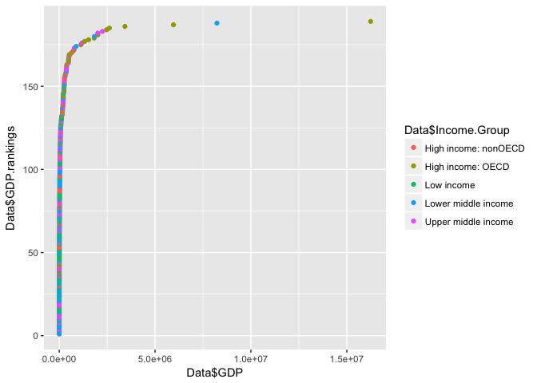

# Educational data vs Gross Domestic Product

```r
# install.packages('knitr', repos = c('http://rforge.net', 'http://cran.rstudio.org'), type = 'source')
Data = read.table(file.path("data", "merged_data.csv"), header = TRUE, encoding='UTF-8')
```

#Introduction
With the global market in flux of the last few years and the rising cost of higher education people are wondering if the investment is worth the cost.  At the same time governments are starting to wonder if the cost of investment into higher education is worth it when the limited budget dollars could be spent on other needed projects.  With this in mind we were asked to look into this problem and compare Education levels with Gross Domsetic Products to see if there was any relationship.  In particular we were asked the following questions.  To merge the data based on the country shortcode and How many IDs matched?  Sort the data frame in ascending order by GDP and what is the thirteenth country in the resulting dataframe?  What are the average GDP rankings for the "High income:OECD" and "High income: nonOECD" groups? To plot the GDP for all of the countries, and use ggplot2 to color you plots by income group. Finally to cut the GDP ranking into 5 seperate quantile groups, making a table versus income group. How many countries are lower middle income but are among the 38 nations with the highest GDP?

###1. With the merged data frame how many IDs matched?

When we merged the Educational data with the GDP data we were bound to have some that did not match.
The number that we ended up mathing together is listed below.

```r
nrow(Data)
```

```
## [1] 189
```
###2. With the the data frame in decending order by GDP(United States last) what is the 13th value?


```r
# reorder by GDP
Data = Data[order(Data$GDP),]
# print 13-th
print(Data[c(13), ])
```

```
##    CountryCode         CountryName GDP        Income.Group
## 93         KNA St. Kitts and Nevis 767 Upper middle income
```

###3. What arethe average GDP rankings for the "High income: OECD" and "High Income:nonOECD" groups?

Comments

```r
Data$GDP.rankings = rank(Data$GDP)
OECD_rankings = Data$GDP.rankings[Data$Income.Group == "High income: OECD"]
print(mean(OECD_rankings))
```

```
## [1] 157.0333
```

```r
nonOECD_rankings = Data$GDP.rankings[Data$Income.Group == "High income: nonOECD"]
print(mean(nonOECD_rankings))
```

```
## [1] 98.34783
```
###4. 1	Plot the GDP for all of the countries. Use ggplot2 to color your plot by Income Group.

COmments

```r
library(ggplot2)
qplot(Data$GDP, Data$GDP.rankings, color = Data$Income.Group)
```

<!-- -->
###5. Cut the GDP rankings into 5 seperate quantile groups. Making a table versus income group.
###   How many countries are "lower middle income" but within the 38 nations with the highest GDP?

COmments

```r
library(dplyr)
```

```
## 
## Attaching package: 'dplyr'
```

```
## The following objects are masked from 'package:stats':
## 
##     filter, lag
```

```
## The following objects are masked from 'package:base':
## 
##     intersect, setdiff, setequal, union
```

```r
Data$QuantGroup <- ntile(Data$GDP.rankings, 5)
# I dont know what this means: Make a table versus Income.Group
#     is this is?
knitr::kable(Data[c('QuantGroup', 'Income.Group')])
```

       QuantGroup  Income.Group         
----  -----------  ---------------------
173             1  Lower middle income  
92              1  Lower middle income  
113             1  Lower middle income  
137             1  Upper middle income  
155             1  Lower middle income  
59              1  Lower middle income  
169             1  Lower middle income  
46              1  Upper middle income  
39              1  Low income           
184             1  Lower middle income  
180             1  Upper middle income  
69              1  Upper middle income  
93              1  Upper middle income  
183             1  Lower middle income  
66              1  Low income           
65              1  Low income           
151             1  Low income           
161             1  Upper middle income  
8               1  Upper middle income  
100             1  Upper middle income  
168             1  Lower middle income  
22              1  Lower middle income  
99              1  Low income           
28              1  Lower middle income  
40              1  Lower middle income  
30              1  Low income           
111             1  Lower middle income  
102             1  Lower middle income  
12              1  Low income           
1               1  High income: nonOECD 
71              1  Lower middle income  
52              1  Low income           
160             1  Lower middle income  
152             1  Low income           
164             1  Low income           
57              1  Upper middle income  
120             1  Low income           
26              1  High income: nonOECD 
122             2  Low income           
117             2  Upper middle income  
156             2  Upper middle income  
23              2  High income: nonOECD 
64              2  Low income           
108             2  High income: nonOECD 
95              2  Lower middle income  
90              2  Low income           
125             2  Low income           
166             2  Low income           
146             2  Low income           
109             2  Lower middle income  
14              2  Low income           
75              2  Low income           
19              2  High income: nonOECD 
116             2  High income: nonOECD 
97              2  Low income           
114             2  Upper middle income  
189             2  Low income           
7               2  Lower middle income  
110             2  Low income           
118             2  Lower middle income  
115             2  Low income           
15              2  Low income           
121             2  Upper middle income  
127             2  Lower middle income  
4               2  Upper middle income  
163             2  Low income           
124             2  Upper middle income  
82              2  High income: OECD    
37              2  Lower middle income  
91              2  Low income           
149             2  Lower middle income  
119             2  Low income           
29              2  Upper middle income  
85              2  Upper middle income  
138             2  Lower middle income  
62              2  Lower middle income  
27              3  High income: nonOECD 
187             3  Low income           
20              3  Upper middle income  
67              3  High income: nonOECD 
60              3  Upper middle income  
73              3  Lower middle income  
130             3  Low income           
175             3  Low income           
2               3  Low income           
188             3  Low income           
54              3  High income: nonOECD 
43              3  High income: nonOECD 
170             3  High income: nonOECD 
153             3  Lower middle income  
35              3  Lower middle income  
36              3  Lower middle income  
142             3  Lower middle income  
24              3  Lower middle income  
174             3  Low income           
105             3  High income: nonOECD 
18              3  High income: nonOECD 
86              3  Lower middle income  
167             3  Lower middle income  
185             3  Lower middle income  
134             3  Upper middle income  
154             3  Upper middle income  
89              3  Low income           
63              3  Low income           
55              3  Low income           
103             3  Upper middle income  
98              3  Upper middle income  
106             3  High income: nonOECD 
41              3  Upper middle income  
158             3  High income: OECD    
171             3  Lower middle income  
177             3  Upper middle income  
70              3  Lower middle income  
17              3  Upper middle income  
179             4  Lower middle income  
104             4  High income: OECD    
148             4  Lower middle income  
48              4  Upper middle income  
74              4  High income: nonOECD 
101             4  Lower middle income  
21              4  Upper middle income  
11              4  Upper middle income  
42              4  Upper middle income  
132             4  High income: nonOECD 
162             4  Lower middle income  
50              4  Lower middle income  
157             4  High income: OECD    
107             4  Lower middle income  
140             4  High income: nonOECD 
3               4  Lower middle income  
16              4  Low income           
76              4  High income: OECD    
182             4  Lower middle income  
96              4  High income: nonOECD 
131             4  High income: OECD    
143             4  High income: nonOECD 
176             4  Lower middle income  
144             4  Upper middle income  
44              4  High income: OECD    
88              4  Upper middle income  
135             4  Upper middle income  
49              4  Upper middle income  
81              4  Lower middle income  
79              4  High income: OECD    
141             4  High income: OECD    
133             4  Lower middle income  
56              4  High income: OECD    
68              4  High income: OECD    
136             4  Lower middle income  
83              4  High income: OECD    
126             4  Lower middle income  
51              4  Lower middle income  
72              5  High income: nonOECD 
33              5  Upper middle income  
150             5  High income: nonOECD 
123             5  Upper middle income  
47              5  High income: OECD    
5               5  High income: nonOECD 
165             5  Lower middle income  
38              5  Upper middle income  
181             5  Upper middle income  
186             5  Upper middle income  
10              5  High income: OECD    
6               5  Upper middle income  
13              5  High income: OECD    
139             5  High income: OECD    
129             5  High income: OECD    
80              5  Upper middle income  
159             5  High income: OECD    
32              5  High income: OECD    
147             5  High income: nonOECD 
128             5  High income: OECD    
172             5  Upper middle income  
77              5  Lower middle income  
94              5  High income: OECD    
112             5  Upper middle income  
53              5  High income: OECD    
9               5  High income: OECD    
31              5  High income: OECD    
78              5  Lower middle income  
84              5  High income: OECD    
145             5  Upper middle income  
25              5  Upper middle income  
61              5  High income: OECD    
58              5  High income: OECD    
45              5  High income: OECD    
87              5  High income: OECD    
34              5  Lower middle income  
178             5  High income: OECD    

```r
top38 <- tail(Data, n = 38)
# this answer: How many countries are "lower middle income" but within the 38 nations with the highest GDP
print(NROW(top38[top38$Income.Group == 'Lower middle income', ]))
```

```
## [1] 5
```

Conclusion
